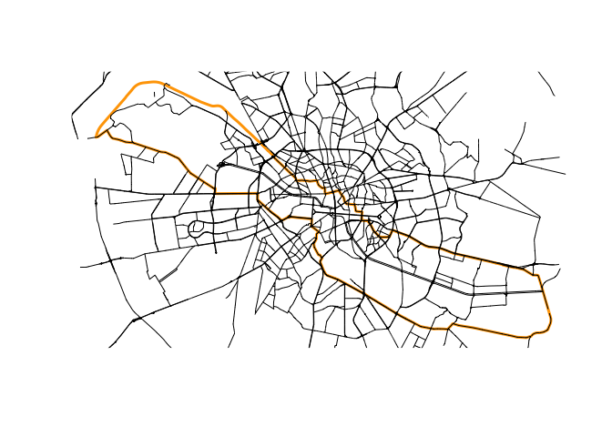

<!-- README.md is generated from README.Rmd. Please edit that file -->

# rcrisp

<!-- badges: start -->

[](https://github.com/CityRiverSpaces/rcrisp/actions/workflows/R-CMD-check.yaml)
[](https://www.repostatus.org/#active)
[](https://doi.org/10.5281/zenodo.15793526)
[](https://CRAN.R-project.org/package=rcrisp)
[](https://lifecycle.r-lib.org/articles/stages.html#stable)
[](https://cityriverspaces.r-universe.dev/)
[](https://research-software-directory.org/software/crisp)
<!-- badges: end -->

rcrisp provides tools to automate the morphological delineation of
riverside urban areas following the CRiSp (City River Spaces) method.

- Website: <https://cityriverspaces.github.io/rcrisp/>
- Get started (purpose & workflow):
  `vignette("getting-started", package = "rcrisp")`

## Workflow at a glance

1.  (Optionally) get OSM and DEM base layers
2.  Run the all-in-one `delineate()` or delineation-specific
    `delineate_*()` functions to compute valley, corridor, segments,
    and/or river space
3.  Visualize/export results for downstream analysis

See the [Getting started
vignette](https://cityriverspaces.github.io/rcrisp/articles/getting-started.html)
for further details about the purpose of the package, an end-to-end
example, data requirements, and indication of use cases.

## Installation

You can install the released version of rcrisp from
[CRAN](https://cran.r-project.org) with:

``` r
install.packages("rcrisp")
```

You can install the development version of rcrisp from
[GitHub](https://github.com/) with:

``` r
# install.packages("pak")
pak::pak("CityRiverSpaces/rcrisp")
```

## Example

This is a basic example which shows you how to solve a common problem:

``` r
library(rcrisp)

# Set location parameters
city_name <- "Bucharest"
river_name <- "Dâmbovița"
epsg_code <- 32635

# Delineate river corridor
bd <- delineate(city_name, river_name, segments = TRUE)

# Get base layer for plotting
bb <- get_osm_bb(city_name)
streets <- get_osm_streets(bb, epsg_code)$geometry
railways <- get_osm_railways(bb, epsg_code)$geometry

# Plot results
plot(bd$corridor)
plot(railways, col = "darkgrey", add = TRUE, lwd = 0.5)
plot(streets, add = TRUE)
plot(bd$segments, border = "orange", add = TRUE, lwd = 3)
plot(bd$corridor, border = "red", add = TRUE, lwd = 3)
```



## Contributing

rcrisp is in a stable state of development, with some degree of active
subsequent development as envisioned by the primary authors.

We also look very much forward to contributions. See the [Contributing
Guide](https://github.com/CityRiverSpaces/rcrisp/blob/main/.github/CONTRIBUTING.md)
for further details.

This package is released with a [Contributor Code of
Conduct](https://github.com/CityRiverSpaces/rcrisp/blob/main/.github/CODE_OF_CONDUCT.md).
By contributing to this project you agree to abide by its terms.
