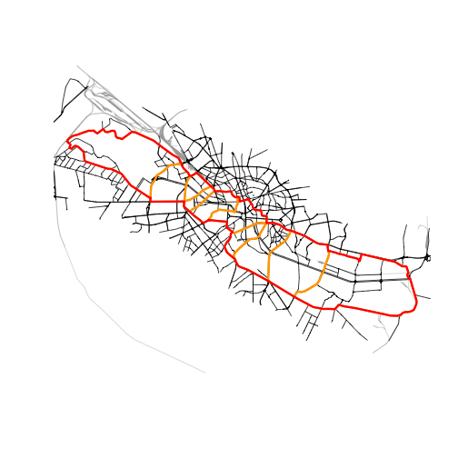

# Getting started with rcrisp

## What is `rcrisp`?

`rcrisp` automates the morphological delineation of riverside urban
areas following a method developed by Forgaci ([2018, pp.
88–89](#ref-forgaci2018)). It overcomes the challenge of arbitrary urban
river corridor delineation by providing a reliable workflow to produce
morphologically grounded spatial analytical units.

Such spatial units enable integrated local analyses (many different
layers within one case) and large-scale cross-case analyses (many cases
using comparable spatial units) in a wide range of domains of
application, such as urban planning, environmental management, public
space design, and disaster risk reduction.

### Why is consistent delineation important?

Riverside areas are often defined inconsistently or arbitrarily.
Different approaches to defining corridor boundaries can produce
substantially different results, each capturing different aspects of the
urban environment while missing others. This inconsistency creates
problems:

- Ambiguous local analyses: which area should be included when studying
  a specific riverside neighborhood or phenomenon?
- Unreliable comparative studies: without a consistent definition,
  comparing the same phenomenon across different cities becomes
  problematic.
- Subjective integrated analyses: when combining multiple data sources,
  the choice of boundaries can bias the results.

The figure below illustrates how alternative delineation approaches can
significantly differ. By contrast, `rcrisp` implements a morphological
delineation method that combines the natural terrain of the river valley
with the configuration of the urban fabric, providing an objective and
reproducible approach.


### What does it do?

In short, given a city name and a river name, `rcrisp`:

- identifies corridor boundaries on the street network along the edges
  of the river valley;
- (optionally) segments the corridor; and
- (optionally) delineates the river space.

## Workflow

The typical workflow consists of the following steps:

1.  Define parameters: Use
    [`define_aoi()`](https://cityriverspaces.github.io/rcrisp/reference/define_aoi.md)
    to set up parameters for a given location, defined by a city name
    and a river name.
2.  Acquire base data: Use
    [`get_osm()`](https://cityriverspaces.github.io/rcrisp/reference/get_osm.md)
    to retrieve OpenStreetMap layers (streets, railways, buildings) and
    [`get_dem()`](https://cityriverspaces.github.io/rcrisp/reference/get_dem.md)
    to download global elevation data.
3.  Run delineation: Use the all-in-one
    [`delineate()`](https://cityriverspaces.github.io/rcrisp/reference/delineate.md)
    function to compute the river valley, corridor, segments, and/or
    river space; or use dedicated `delineate_*()` functions for
    fine-grained control.
4.  Visualize and validate: Use plotting and summary methods to examine
    the results.
5.  Export for downstream analysis: Export the delineations to GIS
    formats or use them directly in R-based analyses.

This workflow can be replicated for any city and river where sufficient
OpenStreetMap and elevation data are available. The reproducibility of
the morphological delineation method makes it suitable for both
single-case local studies and comparative cross-case analyses.

## Data considerations

- Use an appropriate projected CRS (e.g., a relevant UTM EPSG code).
- Verify OSM coverage and elevation availability for your area.
- Spatial (street and railway) network completeness and elevation data
  quality may affect corridor and segment accuracy.
- The
  [`delineate_city_river()`](https://cityriverspaces.github.io/rcrisp/reference/delineate_city_river.md)
  convenience function retrieves OSM data and global DEM data
  automatically, so no additional data retrieval is needed.
- The `delineate_*()` functions allow for any data input, not only OSM
  and global DEM data.

## Example

``` r

library(rcrisp)

# Parameters
city_name <- "Bucharest"
river_name <- "Dâmbovița"

# Delineation
bd <- delineate_city_river(city_name, river_name, segments = TRUE)

# Plot
plot(bd$corridor)
plot(bd$railways$geometry, col = "darkgrey", add = TRUE, lwd = 0.5)
plot(bd$streets$geometry, add = TRUE)
plot(bd$segments, border = "orange", add = TRUE, lwd = 3)
plot(bd$corridor, border = "red", add = TRUE, lwd = 3)
```



## Interpretation and next steps

- Use the segments and/or river spaces for comparative analyses along
  the river; or
- Integrate relevant data layers within a segment and/or river space of
  interest; or
- Run the analysis on other cities to compare a phenomenon of interest
  across corridors, segments and/or river spaces;
- Export to GIS formats for further processing.

## References

Forgaci, C. (2018). *Integrated urban river corridors: Spatial design
for social-ecological integration in bucharest and beyond* \[PhD
thesis\]. <https://doi.org/10.7480/abe.2018.31>
