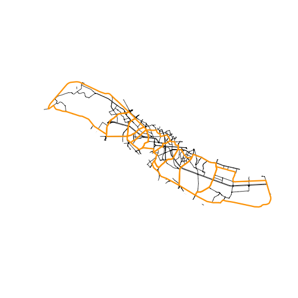

# 6. Corridor segmentation

``` r

library(rcrisp)
library(sf)

bucharest_osm <- get_osm_example_data()
bucharest_dem <- get_dem_example_data()
```

For a more detailed analysis of an urban river corridor, corridor-level
delineation may not be sufficient. The corridor needs to be subdivided
into smaller morphological units. Segmentation is a process of
subdividing the corridor by using major transversal road or rail
infrastructure lines.

By default, the all-in-one function
[`delineate()`](https://cityriverspaces.github.io/rcrisp/reference/delineate.md)
only returns the corridor boundary. The corridor can be segmented either
by setting the argument `segments = TRUE` in
[`delineate()`](https://cityriverspaces.github.io/rcrisp/reference/delineate.md)
or by using the
[`delineate_segments()`](https://cityriverspaces.github.io/rcrisp/reference/delineate_segments.md)
function in a separate step.

To demonstrate this as a separate step, we will use the
`bucharest_dambovita$corridor` from the package data, as well as
`bucharest_osm$streets` and `bucharest_osm$railways` from rcrisp example
data as input.

We first prepare the network and select all the streets and railways
that cover the river corridor plus a small buffer region (see also
`vignette("network-preparation")`):

``` r

# Add a buffer region around the corridor
corridor_buffer <- sf::st_buffer(bucharest_dambovita$corridor, 500)

# Filter the streets and railwayas to the buffer area
streets <- bucharest_osm$streets |>
  sf::st_filter(corridor_buffer, .predicate = sf::st_covered_by)
railways <- bucharest_osm$railways |>
  sf::st_filter(corridor_buffer, .predicate = sf::st_covered_by)

# Build combined street and railway network
network_filtered <- rbind(streets, railways) |>
  as_network()
```

We then delineate segments in the corridor. The algorithm spits the
corridor using river-crossing transversal edges that form continuous
lines in the network:

``` r

segmented_corridor <-
  delineate_segments(bucharest_dambovita$corridor,
                     network_filtered,
                     st_geometry(bucharest_osm$river_centerline))
```

``` r

plot(st_geometry(streets))
plot(segmented_corridor, border = "orange", lwd = 3, add = TRUE)
```


