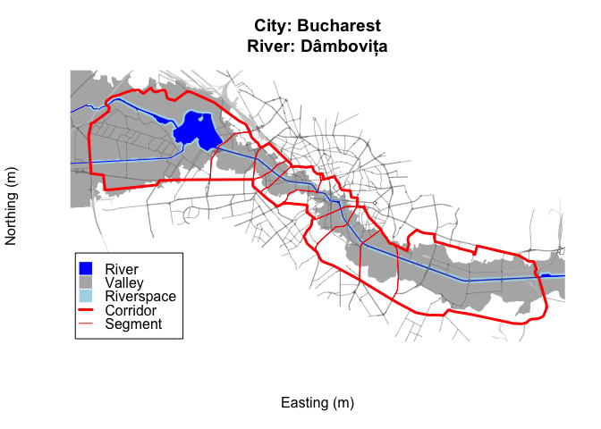

# rcrisp

rcrisp provides tools to automate the morphological delineation of
riverside urban areas following a method developed in Forgaci ([2018,
pp. 88–89](#ref-forgaci2018)). The method is based on the premise that
analyses of riverside urban phenomena are often done without a clear and
consistent spatial definition of the area of interest and that a
morphological delineation can provide a more objective and comparable
approach.

Accordingly, the method proposes a hierarchical delineation of four
spatial units: the river valley, the river corridor, the corridor
segments and the river space. These units are defined based on the
combined morphologies of the river valley and urban form. The resulting
delineations can be used in any downstream analysis of riverside urban
areas that can benefit from consistent and comparable spatial units,
including land use, accessibility, and ecosystem services assessments.

The package includes functions to delineate the river valley, the river
corridor, the corridor segments, and the river space (i.e., the area
between the riverbanks and the first line of buildings) as well as an
all-in-one function that runs all desired delineations. The package also
includes functions to download and preprocess OpenStreetMap (OSM) and
global Digital Elevation Model (DEM) data, which are required as input
data for the delineation process.

## Workflow at a glance

1.  Define area of interest and parameters for a given city and a river
    crossing it
2.  Get OSM and DEM base layers within the area of interest
3.  Run the all-in-one
    [`delineate()`](https://cityriverspaces.github.io/rcrisp/reference/delineate.md)
    or delineation-specific `delineate_*()` functions to compute valley,
    corridor, segments, and/or river space
4.  Visualize/export results for downstream analysis

See the [Getting started
vignette](https://cityriverspaces.github.io/rcrisp/articles/getting-started.html)
for further details about the purpose of the package, an end-to-end
example, data requirements, and indication of use cases.

## Installation

You can install the released version of rcrisp from
[CRAN](https://cran.r-project.org) with:

``` r

install.packages("rcrisp")
```

You can install the development version of rcrisp from
[GitHub](https://github.com/) with:

``` r

# install.packages("pak")
pak::pak("CityRiverSpaces/rcrisp")
```

## Example

This is a basic example which shows you how to solve a common problem:

``` r

library(rcrisp)

# Set location parameters
city_name <- "Bucharest"
river_name <- "Dâmbovița"

# Set AoI parameters for given location
aoi <- define_aoi(city_name, river_name)

# Get data
osm <- get_osm(aoi)
dem <- get_dem(aoi, osm)

# Delineate river corridor with segments
bd <- delineate(aoi, osm, dem, segments = TRUE, riverspace = TRUE)

# Examine delineation object
summary(bd)
#> Delineation: Bucharest - Dâmbovița 
#> CRS:         WGS 84 / UTM zone 35N 
#> 
#> Delineation parameters:
#>   network_buffer   3000 m
#>   dem_buffer       2500 m
#>   buildings_buffer 100 m
#> 
#> Delineation layers:
#>   $valley          101.1 km²
#>   $corridor        65.8 km²
#>   $segments        10 features, total 65.8 km² (mean 6.6 km²)
#>   $riverspace      9.3 km²
#> 
#> Base layers:
#>   $streets         5112 features
#>   $railways        677 features
#>   $river_centerline 270.6 km
#>   $river_surface   3.4 km²

# Plot delineation object
plot(bd)
```



## Contributing

rcrisp is in a stable state of development, with some degree of active
subsequent development as envisioned by the primary authors.

We also look very much forward to contributions. See the [Contributing
Guide](https://github.com/CityRiverSpaces/rcrisp/blob/main/.github/CONTRIBUTING.md)
for further details.

This package is released with a [Contributor Code of
Conduct](https://github.com/CityRiverSpaces/rcrisp/blob/main/.github/CODE_OF_CONDUCT.md).
By contributing to this project you agree to abide by its terms.

## References

Forgaci, C. (2018). *Integrated urban river corridors: Spatial design
for social-ecological integration in bucharest and beyond* \[PhD
thesis\]. <https://doi.org/10.7480/abe.2018.31>
