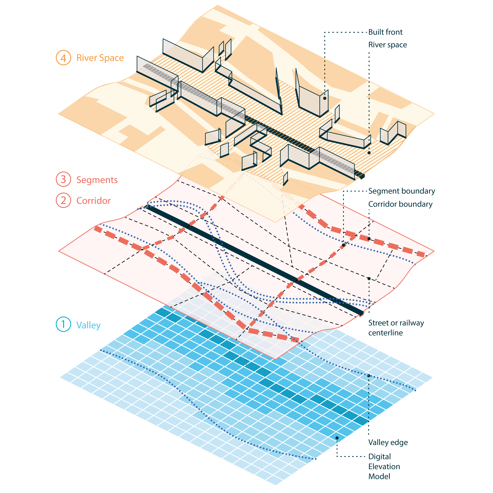

# Summary

`rcrisp` provides tools to automate the morphological delineation of riverside urban areas—i.e., the spaces surrounding a river where social, environmental and economic phenomena are assumed to be influenced by the presence of the river—following a method developed in @forgaci2018 [pp. 88-89]. The method is based on the premise that analyses of riverside urban phenomena are often done without a clear and consistent spatial definition of the area of interest and that a morphological delineation—combining the natural terrain of the river valley and the configuration of the overlapping built urban fabric—can provide a more objective and comparable approach. Delineations following this morphological delineation method enable integrated local analyses, where data from different sources must be combined within a neutral spatial unit, as well as global cross-case analyses, which require a spatial unit that is comparable across different geographic contexts. The method proposes a hierarchical delineation of four spatial units: the river valley, the river corridor, the corridor segments, and the river space (i.e., the area between the riverbanks and the first line of buildings). Accordingly, `rcrisp` includes functions to delineate each, as well as an all-in-one function that runs all desired delineations. The package also includes functions to download and preprocess OpenStreetMap (OSM) and global Digital Elevation Model (DEM) data, which are required as input data for the delineation process. The resulting delineations can be used in any downstream analysis of riverside urban areas that can benefit from consistent and comparable spatial units, including land use, accessibility, and ecosystem services assessments.

# Statement of need

Urban rivers and the urban areas surrounding them, hereinafter referred to as urban river spaces (URS), have come to the forefront of sustainable urban transformations worldwide. This trend is not only due to pounding water-related disturbances such as floods or water scarcity, but also because the vital role of rivers in supporting social and ecological processes is increasingly acknowledged. As researchers and practitioners of the urban environment engage into understanding or tackling current URS transformations, they face the challenge of capturing the complexities of environmental, social, and ecological phenomena in an integrated way [@prominski2023]. Moreover, considering the global extent of the phenomenon, they lack established frames of comparison that may reveal local specificities and cross-case similarities. An essential part of the challenge is how urban areas surrounding rivers are delineated—that is, how their boundaries are drawn for analytical or intervention purposes—, as the resulting spatial units can considerably impact decisions made for urban riverspace transformations. More often than not, URS boundaries are determined without a systematic and reproducible delineation method, wherever suitable spatial data is available, based on census tracts, using rivers as boundaries, using neutral (square or circular) cut-outs, at different levels of aggregation (city, district, neighbourhood), or areas of study specific to a local urban development project. None of these approaches to delineation are suitable for a reliable integrated understanding of URSs, as they are to a large extent arbitrary. An integrated understanding of URS requires spatial morphological units of analysis that reflect the combined “footprints” of environmental, social and ecological processes [@marcus2016]. This is a case of the modifiable areal unit problem (MAUP) [@openshaw1984] with a considerable impact on decisions taken in environmental, mobility, ecological, and public space planning and design. Accordingly, `rcrisp` is designed to address a diverse, growing and cross-disciplinary research community concerned with understanding URSs in an integrated and scalable way. It is intended to open new research avenues, such as integrated local spatial analyses and global cross-case analyses, which have been so far hindered by data- or workflow-related difficulties.

# State of the field

Most current software which may be usable for URS delineation purposes either rely on GUI-based GIS software that involve several manual steps that hinder scalability and reproducibility, or they are too generic for specialized applications such as URS delineation and analysis. Urban morphometrics, a growing sub-field of urban morphology, focuses mostly on the analysis of street networks, such as the Python package *OSMnx* [@boeing2025] and the R package `sfnetworks` [@vandermeer2024], or on elements of built form, such as the Python toolkit *momepy* [@fleischmann2019; @fleischmann2022]. These tools are not fit for specialised applications in URSs as they exclusively focus on generic elements of urban form and as such do not integrate green spaces and river spaces. On the other hand, river space delineation methods and software, like the one developed by the *Vermont Agency of Natural Resources* [-@vermontagencyofnaturalresources2007] and the ATRIC tool developed by Bhowmik et al. [-@bhowmik2015]*,* mostly focus on non-urban contexts on a larger scale, where reading geomorphological information from digital elevation models in the absence of buildings and urban infrastructure is easier. Also, such specialised tools are either not open or they are not actively maintained.

# Software design

`rcrisp` is an R package that builds on a previously developed delineation method @forgaci2018 [pp. 88-89], which considers the morphology of the river valley and that of the urban fabric jointly. `rcrisp` automates that method of delineation, while leveraging global geospatial data—OpenStreetMap [@openstre2025] and Global DEM [@copernicus2019] data—increasingly available for large-scale analyses [@forgaci2020].

`rcrisp` is structured into four core delineation modules (Figure 1), namely `valley`, `corridor`, `segments`, and `riverspace` for the four delineation steps, as well as an all-encompassing `delineate` module which runs the entire delineation workflow. The output is an object of class `delineation`. The delineation process is implemented using the following algorithms:

1.  The `valley` module implements a cost distance algorithm to determine the river valley boundaries from a DEM, variants of which are mostly used for wet area mapping and valley bottom delineation in non-urban contexts [@ågren2014; @murphy2009; @white2012].

2.  The `corridor` module uses a shortest path algorithm to determine the corridor edges on the street network obtained from OpenStreetMap. For both sides of the river, the shortest paths which are closest to the valley boundaries are chosen for the corridor edge.

3.  The `segments` module uses the COINS algorithm [@tripathy2020] implemented in the rcoins R package [@rcoins] to determine continuous lines along the street network starting from bridges crossing the river. The resulting continuous lines are used to divide the corridor into corridor segments.

4.  The `riverspace` module applies an isovist algorithm implemented in the visor R package [@visor] to determine the space enclosed by the first line of buildings around the river within a given visibility distance.

An `aoi` module is used to set location parameters as input for delineation. The dedicated `network` and `sf` modules contain functionality needed for processing `sfnetwork` [@vandermeer2024a] and `sf` [@pebesma2018] objects, respectively. The retrieval of OSM data is available from the `osm` module, while example delineation data and example OSM data used in the documentation are available from the `data` and `exampeldata` modules. Utility functions are collected in a `utils` module and the `cache` module is used to retain and manage OSM and DEM data retrieved by the user.

A typical workflow consists of the following steps:

1.  Define area of interest and parameters for a given city and a given river crossing it, using their names as input.

2.  Get OSM and DEM base layers within the area of interest.

3.  Run the all-in-one `delineate()` or delineation-specific `delineate_*()` functions to compute valley, corridor, segments, and/or riverspace. As an alternative to points 1-3, run the convenience function `delineate_city_river()`.

4.  Inspect and visualize the resulting delineation using `summary()` and `plot()` methods specific to the `delineation` class.

5.  Export results in a desired geospatial format for downstream analysis.

# Research impact statement

The significance of `rcrisp` has been demonstrated during early development as part of an interdisciplinary Lorentz Workshop in Leiden, the Netherlands, which brought together an international group of researchers, practitioners and students concerned with sustainable urban riverspace transformations. During the workshop, delineations for 17 international cases were validated and various use cases were discussed. Broad applications beyond rivers, i.e., for waterways in general (including canals and streams), as well as non-waterway-related use cases (e.g., urban catchment area along a given route) were also identified. A position paper resulting from the workshop presents `rcrisp` as a catalyst for the development of a community around morphological urban riverspace transformations. The use of `rcrisp` has also been confirmed in research and education [e.g., @hao2026] and the software continues to be employed in both.

# AI usage disclosure

GitHub Copilot was used to expedite the review of GitHub pull requests. Claude Sonnet 4.6, Claude Opus 4.6, and Claude Opus 4.7 were used for test scaffolding in order to increase test coverage and identify edge cases, dummy data creation for tests, debugging, and the initial drafting of a benchmarking script. No other generative AI tools were used in the development of this software or the writing of this manuscript. The AI-generated code has been verified for correctness, accuracy and completeness, adapted where needed, and approved by the authors.

# Acknowledgements

`rcrisp` was funded by the Netherlands eScience Center (grant no. NLESC.OEC.2023.050). We acknowledge contributions from Fakhereh Alidoost, Meiert Willem Grootes, and Yehan Wu.

# References
