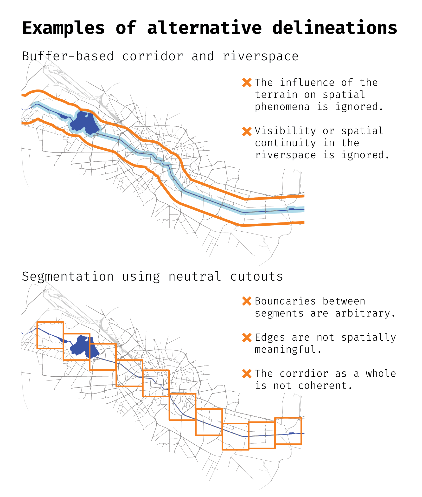

# What is `rcrisp`?

`rcrisp` automates the morphological delineation of riverside urban areas following a method developed by @forgaci2018 [pp. 88-89]. It overcomes the challenge of arbitrary urban river corridor delineation by providing a reliable workflow to produce morphologically grounded spatial analytical units.

Such spatial units enable integrated local analyses (many different layers within one case) and large-scale cross-case analyses (many cases using comparable spatial units) in a wide range of domains of application, such as urban planning, environmental management, public space design, and disaster risk reduction.

## Why is consistent delineation important?

Riverside areas are often defined inconsistently or arbitrarily. Different approaches to defining corridor boundaries can produce substantially different results, each capturing different aspects of the urban environment while missing others. This inconsistency creates problems:

- Ambiguous local analyses: which area should be included when studying a specific riverside neighborhood or phenomenon?
- Unreliable comparative studies: without a consistent definition, comparing the same phenomenon across different cities becomes problematic.
- Subjective integrated analyses: when combining multiple data sources, the choice of boundaries can bias the results.

The figure below illustrates how alternative delineation approaches can significantly differ. By contrast, `rcrisp` implements a morphological delineation method that combines the natural terrain of the river valley with the configuration of the urban fabric, providing an objective and reproducible approach.



## What does it do?

In short, given a city name and a river name, `rcrisp`:

- identifies corridor boundaries on the street network along the edges of the river valley;
- (optionally) segments the corridor; and
- (optionally) delineates the river space.

# Workflow

1. Acquire base data:
   - OpenStreetMap layers using `get_osm_*()` functions
   - (Optional) global Digital Elevation Model data
2. Delineate the river valley, corridor, segments and/or riverspace with the all-in-one `delineate()` function or with the dedicated `delineate_*()` functions
3. Visualize, validate, and export results for use in downstream analyses

# Data considerations

- Use an appropriate projected CRS (e.g., a relevant UTM EPSG code).
- Verify OSM coverage and elevation availability for your area.
- Spatial (street and railway) network completeness and elevation data quality may affect corridor and segment accuracy.
- The `delineate()` function retrieves OSM data and global DEM data by default, so no additional data retrieval is needed.
- The `delineate_*()` functions allow for any data input, not only OSM and global DEM data.

# Example


``` r
library(rcrisp)

# Parameters
city_name <- "Bucharest"
river_name <- "Dâmbovița"
epsg_code <- 32635

# Delineation
bd <- delineate(city_name, river_name, segments = TRUE)
#> Error in delineate(city_name, river_name, segments = TRUE): Assertion on 'aoi' failed: Must be of type 'list', not 'character'.

# Base layers for visualisation
bb <- get_osm_bb(city_name)
streets <- get_osm_streets(bb, epsg_code)$geometry
railways <- get_osm_railways(bb, epsg_code)$geometry

# Plot
plot(bd$corridor)
#> Error: object 'bd' not found
plot(railways, col = "darkgrey", add = TRUE, lwd = 0.5)
#> Error in plot.xy(xy.coords(x, y), type = type, ...): plot.new has not been called yet
plot(streets, add = TRUE)
#> Error in plot.xy(xy.coords(x, y), type = type, ...): plot.new has not been called yet
plot(bd$segments, border = "orange", add = TRUE, lwd = 3)
#> Error: object 'bd' not found
plot(bd$corridor, border = "red", add = TRUE, lwd = 3)
#> Error: object 'bd' not found
```

# Interpretation and next steps

- Use the segments and/or river spaces for comparative analyses along the river; or
- Integrate relevant data layers within a segment and/or river space of interest; or
- Run the analysis on other cities to compare a phenomenon of interest across corridors, segments and/or river spaces;
- Export to GIS formats for further processing.

# References
