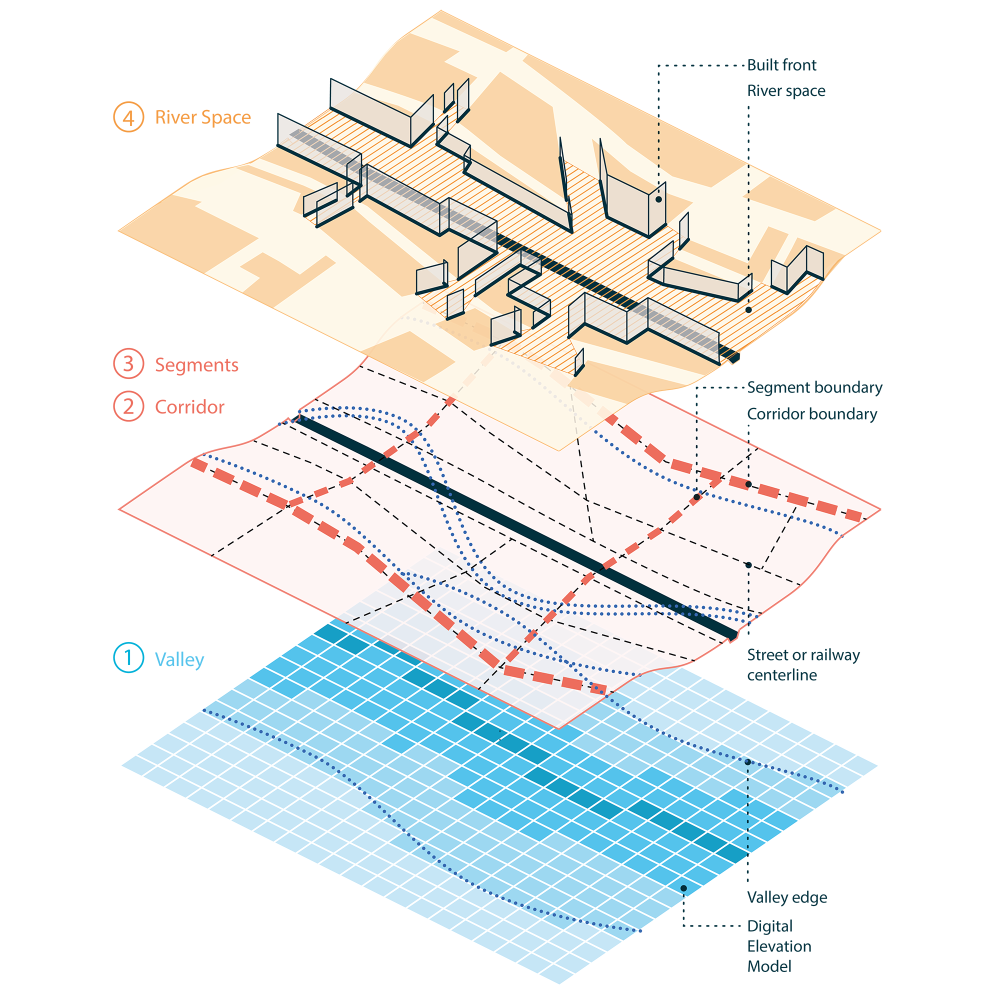

```{r, include=FALSE}
knitr::opts_chunk$set(
  collapse = TRUE,
  comment = "#>"
)
```

```{r srr-tags, eval=FALSE, echo=FALSE}
#' @srrstats {G1.0} This vignette provides a publication describing an early
#'   version of the method implemented in the package.
#' @srrstats {G1.1} It is specified here that `rcrisp` is the first
#'   implementation of a novel algorithm.
```

rcrisp is the first implementation of a spatial morphological method of delineation ([Forgaci, 2018](https://doi.org/10.7480/abe.2018.31)) that considers both the terrain of the river valley and the configuration of the urban fabric, as shown in the diagram below.

```{r fig.align='center', fig.alt='Diagram of the method of delineation', echo=FALSE, out.width="100%"}

```

The method consists of the following steps, each explained on this website in a separate article:

1. The **valley** is delineated using a cost distance accumulation analysis on a Digital Elevation Model, as shown in `vignette("valley-delineation")`. The resulting valley edge is used as one of the inputs in the next step.

2. The urban **corridor** surrounding the river is delineated on the street network along a path following road centrelines that is closest to the valley edge, as shown in `vignette("corridor-delineation")`.  

3. The delineated corridor is divided into **corridor segments** bounded by the main transversal streets, as shown in `vignette("corridor-segmentation")`.  

4. The **river space**, i.e., the space between the river and the first line of buildings is determined, as shown in `vignette("riverspace-delineation")`.


