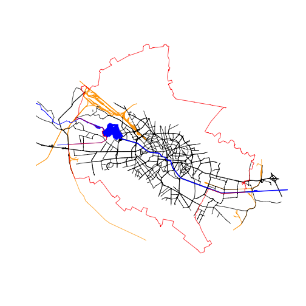

<!-- the *.Rmd vignettes are generated from the *.Rmd.orig files. Please edit those files. -->


In this notebook we download OpenStreetMap (OSM) data needed for the delineation of the urban river corridor of River Dâmbovita in Bucharest, Romania.
The simplest approach is to use `define_aoi()` to set up parameters with automatic CRS selection, then fetch all OSM data with `get_osm()`.


``` r
library(rcrisp)
library(purrr)

city_name <- "Bucharest"
river_name <- "Dâmbovita"

# Define area of interest with automatic CRS selection
aoi <- define_aoi(city_name, river_name,
                  network_buffer = 3000,    # in m
                  buildings_buffer = 100)   # in m

# Retrieve all OSM data
bucharest_osm <- get_osm(aoi)
```

The resulting object is a list with all the OSM layers needed for delineation.


``` r
names(bucharest_osm)
#> [1] "bb"               "river_centerline" "aoi_network"      "streets"         
#> [5] "railways"         "river_surface"    "aoi_buildings"    "buildings"       
#> [9] "boundary"
```

<div class="figure">

<p class="caption">All layers combined (buildings not shown)</p>
</div>

Individual layers can be written to disk before being read in for delineation.


``` r
walk2(
  bucharest_osm,
  names(bucharest_osm),
  ~ st_write(
    .x,
    dsn = sprintf("%s_%s.gpkg", .y, city_name),
    append = FALSE,
    quiet = TRUE
  )
)
```
